## Arquitetura geral

Breve explicação da arquitetura.

Esse projeto foi desenvolvido utilizando 4 microservicos que serão detalhados abaixo e 1 cronjob que não foi desenvolvido. Devido a natureza do python ser sincrono preferi utilizar o sistema de filas do rabbitmq para salvar erros de exception, para termos um monitoramento de falhas e retornando o erro para o usuário direto na api. 

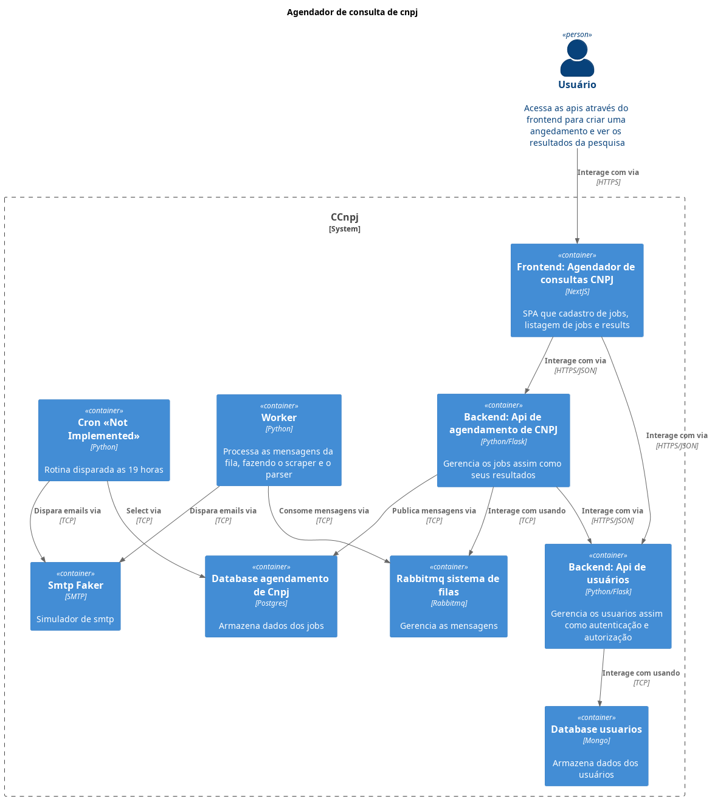


## Configurações

A principio pensei em utilizar o kind para simular um kubernetes mas dai o docker-compose foi uma solução mais fácil. Todas as imagens estão publicadas no docker hub como podem ver no código fonte não sendo necessário buildar. 

Os serviços abaixos foram levantados um a um. Podendo também dar um `docker compose up` para subir todos de uma vez.

### Postgresql

Levantar o servico `docker compose up postgresql` entrar no container `docker compose exec postgresql sh` e criar o banco de dados `createdb -U postgres agendadorcnpj`

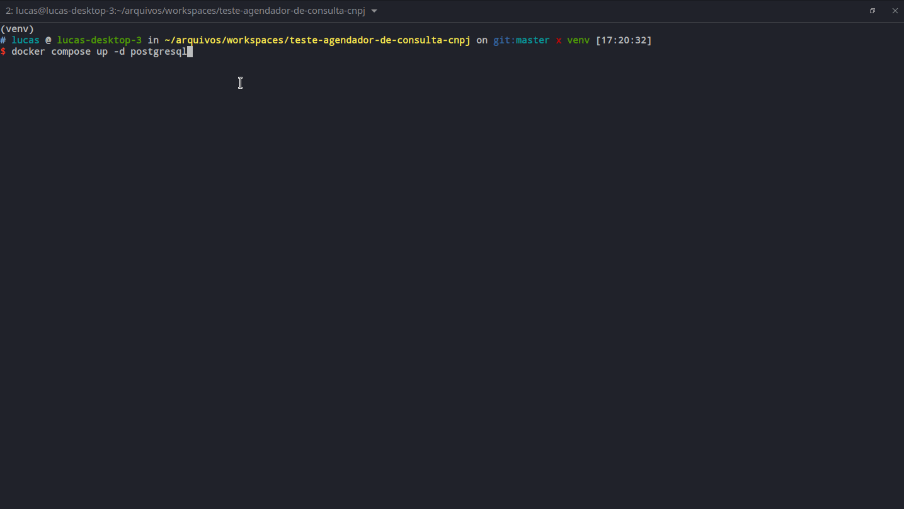

### Mongodb

Levantar o servico `docker compose up mongodb`.

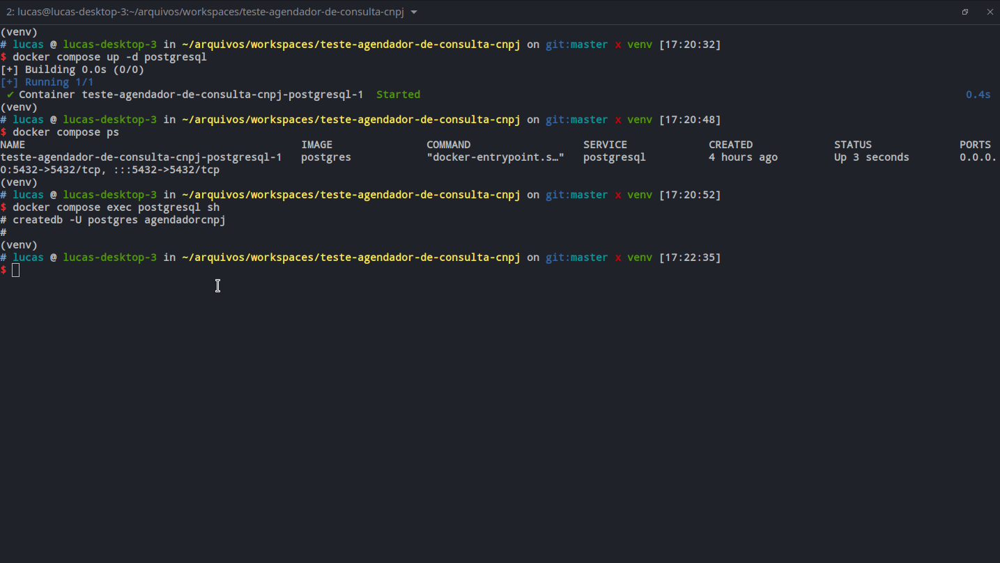

### RabbitMQ

Levantar o servico `docker compose up rabbitmq`

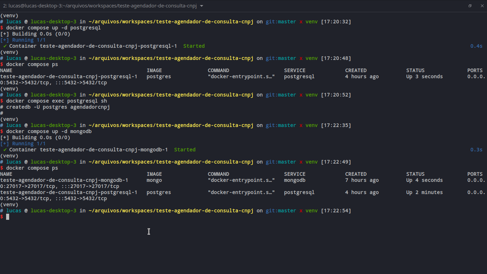

É preciso criar as filas as exchanges e fazer seus respectivos binds. Ver mais quando levantar o serviço Api Agendador de consultas cnpj

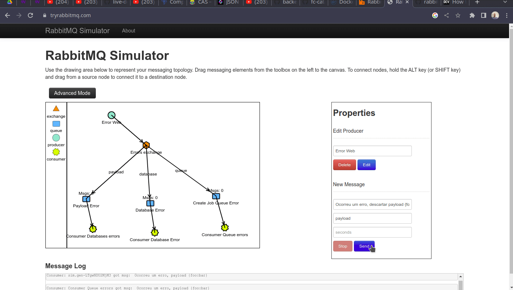

Erros de payload, database e erros de fila são enviados para o rabbitmq. O objetivo aqui é através de mensagens diagnosticar qual o erro ocorreu e tentar recuperar esses dados futuramente com um worker proprio. Claro que algumas mensagens serão descartadas.

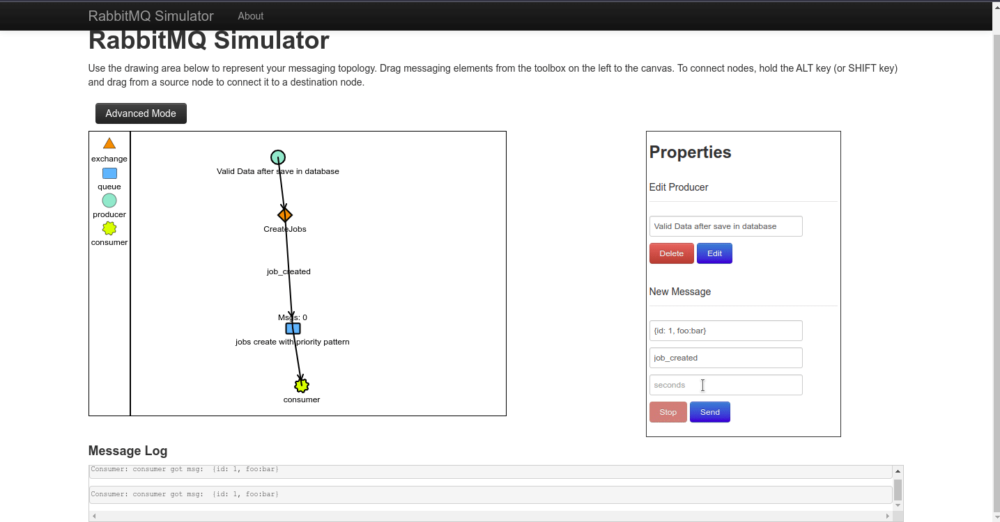

Quando um job é cadastrado com sucesso é publicado uma mensagem para a fila


### Mailhog

Levantar o servico `docker compose up mailhog`

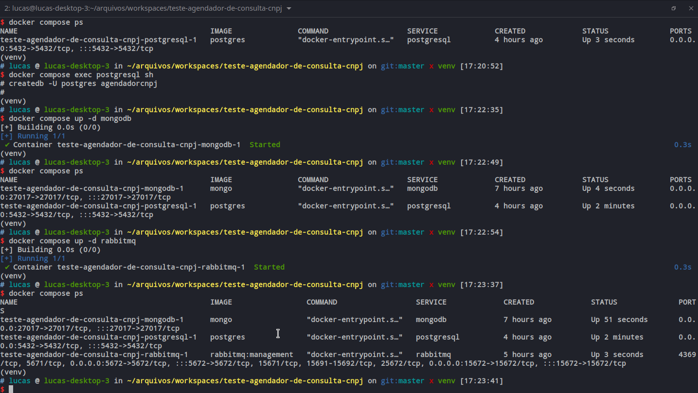

### Api Users

Github: https://github.com/lucassimon/flask-api-users

Levantar o servico `docker compose up users`

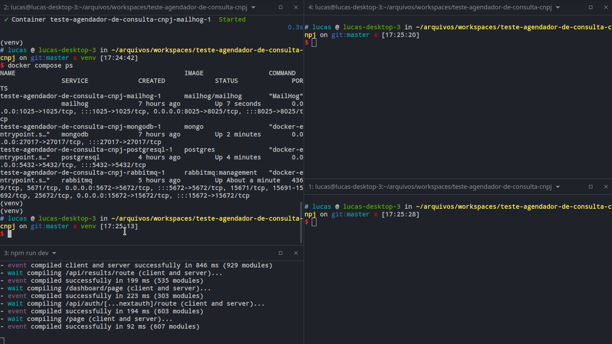

- [X] Cadastro de usuários
- [X] autenticação e autorização
- [X] banco de dados Mongo
Utilizado o mongodb pois reutilizei esse projeto que fiz.
- [X] Docker
- [X] Testes

P.S. Ao criar usuarios informar qualquer numero no campo cpf_cnpj com 14 digitos

### Api Agendador de consultas cnpj

Github: https://github.com/lucassimon/agendador-de-consulta-de-cnpj

Levantar o servico `docker compose up agendador`

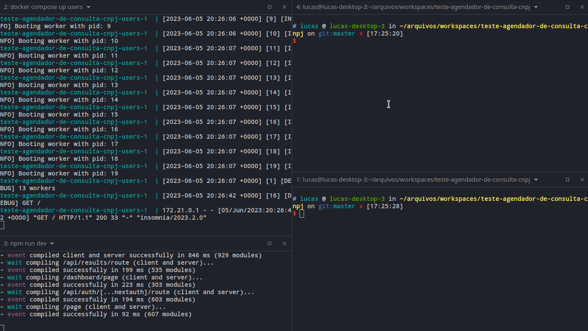

- [X] detecção e recuperação de falhas
Erros de Exception são enviadas para uma fila no rabbitmq. Acho que assim resolvo esse problema
- [X] banco de dados PostgreSQL
- [X] Docker
- [ ] Testes

1. Quando levantar o serviço executar  o comando `docker compose exec agendador sh` e dentro do container executar as migrations `flask db upgrade head`. Isso ira subir as migrations e criar as tabelas necessarias

2. Ainda dentro do container executar `flask createqueue`. Esse comando ira criar as filas necessarias.

### Worker consulta cnpj

Github: https://github.com/lucassimon/worker-consulta-cnpj

Levantar o servico `docker compose up worker`

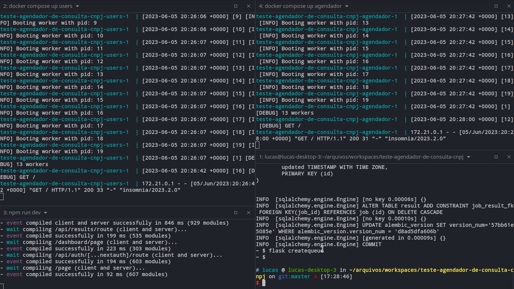

- [X] Um algoritmo é utilizado para selecionar a próxima tarefa da fila com base em critérios como ordem de chegada ou prioridade
- [ ] Scraper com hcaptcha
Não consegui implementar uma solução de scraper utilizando o playwright e por causa de um hcaptcha que não consegui quebrar. Porém deixei um exemplo de como faria o parse de dados através da biblioteca lxml parseando os dados do html.
- [X] E-mails são enviados no início e no final de cada tarefa
Utilizado o mailhog para receber email
- [X] Docker

Nenhuma configuração a mais será necessário

### Nextjs Agendador de cnpj

Github: https://github.com/lucassimon/nextjs-agendador-de-consulta-de-cnpj


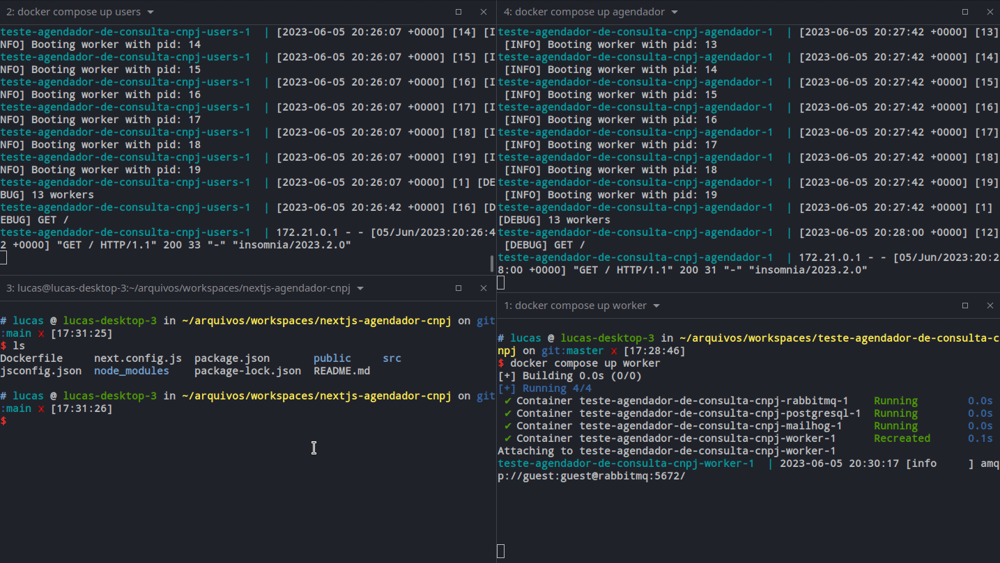

Devido ha um erro que até o momento não consegui diagnosticar, talvez seja cors, não coloquei o frontend no docker-compose. 

```> fetch
[AsyncFunction: fetch]
> const res = await fetch("http://agendador:8081/")
Uncaught TypeError: fetch failed
    at Object.fetch (node:internal/deps/undici/undici:11457:11)
    at process.processTicksAndRejections (node:internal/process/task_queues:95:5)
    at async REPL2:1:37 {
  cause: Error: connect ECONNREFUSED 172.21.0.7:8081
      at TCPConnectWrap.afterConnect [as oncomplete] (node:net:1494:16)
      at TCPConnectWrap.callbackTrampoline (node:internal/async_hooks:130:17) {
    errno: -111,
    code: 'ECONNREFUSED',
    syscall: 'connect',
    address: '172.21.0.7',
    port: 8081
  }
}
```

Sendo assim o frontend deve ser baixado através do `git clone ...`, instalado suas dependências, copiado o `cp .env-example .env` e executar o server `npm run dev`

- [X] Um formulário de agendamento é fornecido
- [X] Os agendamentos existentes são exibidos em uma lista ou calendário, permitindo a edição ou exclusão das tarefas agendadas.
- [ ] Docker
- [ ] Testes
- [ ] Corrigir expires do token com nextauth
- [ ] Corrigir rotação de token com refreshToken no nextAuth
- [ ] Adicionar um framework css

### CronJob

- [ ] agendador interno envia um resumo diário das tarefas realizadas às 7 horas da noite

Devido ao tempo a extensão do projeto não fiz a implementação. Mas o conceito seria simples. Contruir um script python e coloca-lo para executar via cronjob. Esse script faria um select na base dados buscando os agendamentos das ultimas 24 horas, agrupando por usuario e enviando por email.

## Evidencias e Explicações de funcionalidades

Evidencias, explicações e comentarios acerca do projeto e da arquitetura escolhida.

### Criar usuario

[Youtube](https://youtu.be/8ZiVrUSmavg)

### Autenticar usuario

[Youtube](https://youtu.be/O0xScm85OZA)

### Criar um job

[Youtube](https://youtu.be/9MaYpoxdEwk)

### Worker e Fake Scraper/Parse

[Youtube](https://youtu.be/zmZkw7TJerI)